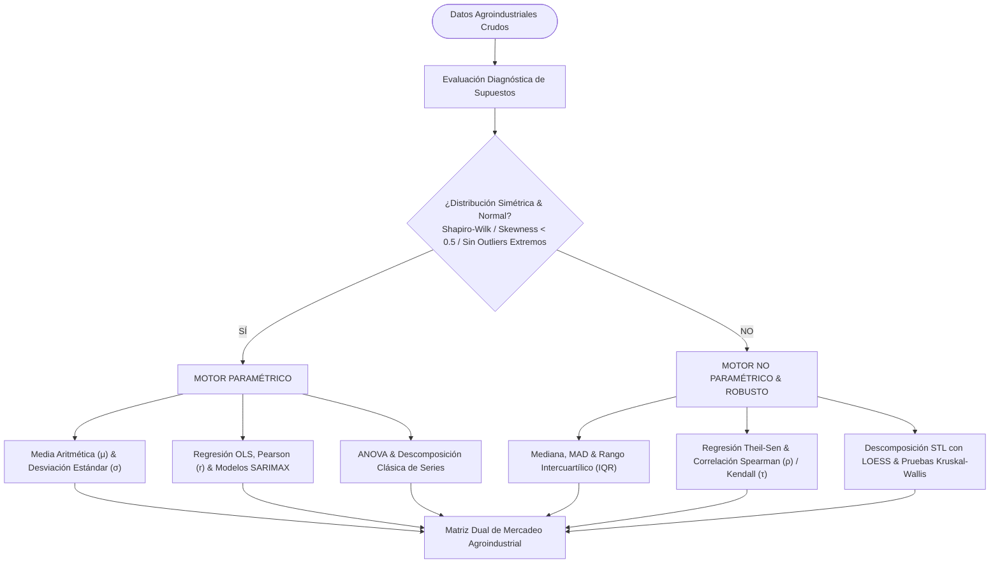

# Inspección Estadística — Parte I: Propósito de Mercadeo Agroindustrial, Alcance, Enfoque y Objetivos
**Proyecto**: AgroData Intelligence Platform (`AgroStatsApp`)  
**Versión**: 2.1.0  
**Fecha**: 2026-10-07  
**Fase PDCO**: PLAN → DEVELOPMENT  
**Enfoque de Negocio**: App de Inteligencia de Mercadeo Agroindustrial y Minería de Datos (Data Mining)  
**Alcance Sectorial**: Exclusivamente Agrícola y Agroindustrial (Sector pecuario y ganadero excluido formalmente)  

---

## 1. Declaración de Misión: Mercadeo Agroindustrial y Data Mining

La plataforma **AgroStatsApp** está concebida como un sistema avanzado de **Inteligencia de Mercadeo Agroindustrial (*Agro-industrial Market Intelligence & Data Mining Platform*)**, orientado a transformar grandes volúmenes de datos dispersos en ventajas estratégicas, reconocimiento de dinámicas de mercado y valoración económica para los actores de la cadena agroindustrial (productores agrícolas, procesadores, transformadores agroindustriales, distribuidores mayoristas y comercializadores internacionales).

### 1.1 Exclusión de la Actividad Pecuaria
Por directriz arquitectónica y de negocio, **el sistema no considera la parte pecuaria** (excluye explícitamente ganadería bovina, porcina, avícola, ovinocaprina y derivados lácteos primarios no agroindustriales). Todo el esfuerzo de captura, limpieza, modelado y minería de datos se focaliza en:
- **Cadenas de Cultivos Agrícolas**: Frutas, hortalizas, tubérculos, plátanos, granos, café, cacao, caña, palma y oleaginosas.
- **Transformación Agroindustrial y Valor Agregado**: Relación entre producto primario agrícola y su procesamiento industrial (Cuenta Satélite de la Agroindustria DANE - CSAA).
- **Flujos Comerciales y Abastecimiento**: Dinámica de orígenes agrícolas municipales hacia nodos y centrales mayoristas de abasto urbano (SIPSA Abastecimientos).
- **Formación de Precios y Volatilidad Mayorista**: Cotizaciones de mercado en tiempo real y series históricas por plaza comercial (SIPSA Precios).
- **Insumos y Estructura de Costos Agrícolas**: Fertilizantes, plaguicidas, semillas y coadyuvantes agrícolas (AgroNET Insumos).
- **Comercio Exterior Agroindustrial**: Exportaciones FOB, volúmenes en kilogramos y destinos internacionales de subpartidas arancelarias agrícolas (DANE/DIAN EXPO).

---

## 2. Punto 1: Qué se Busca Analizar en el Mercado Agroindustrial

Desde una perspectiva analítica y de minería de datos aplicada al mercadeo agroindustrial, el sistema analiza:

### 2.1 Estructuras de Flujos Comerciales y Redes de Abastecimiento (Logística de Mercado)
- **Topología de red origen-destino**: Grafo dirigido ponderado $G = (V, E, W)$ donde los orígenes representan municipios agrícolas y los destinos centrales de abasto mayorista.
- **Concentración de la oferta comercial**: Índices de Hirschman-Herfindahl ($HHI$) y coeficientes de concentración $CR_4 / CR_8$ para identificar municipios que dominan el suministro a grandes urbes.
- **Rutas críticas y vulnerabilidad de suministro**: Identificación de corredores logísticos cuya interrupción impacta la oferta en plazas consumidoras.

### 2.2 Dinámica de Formación de Precios, Arbitraje y Volatilidad
- **Gradientes de precio inter-plazas**: Medición de brechas de cotización entre mercados mayoristas para detectar ineficiencias de intermediación o márgenes de arbitraje espacial.
- **Volatilidad y riesgo de precio**: Coeficientes de variación temporal y transversal, distinguiendo entre productos de cotización estable y productos altamente especulativos.
- **Elasticidad y transmisión de precios**: Velocidad y simetría con la que un cambio de oferta en origen se traslada al precio mayorista en destino.

### 2.3 Estacionalidad y Ventanas de Oportunidad Comercial
- **Ciclos estacionales de oferta**: Detección de picos de cosecha (*harvest peaks*) y periodos de escasez relativa mediante descomposición estacional (STL/Loess).
- **Desfase estacional de precios**: Identificación de ventanas comerciales donde la oferta se contrae y los precios mayoristas alcanzan sus máximos relativos.

### 2.4 Cadena de Valor, Transformación y Comercio Exterior
- **Ratio de transformación agroindustrial**: Relación entre el valor de producción agrícola primaria y el Valor Agregado Bruto (VAB) generado en la fase industrial.
- **Competitividad en mercados internacionales**: Valor FOB por kilogramo exportado, tasa de crecimiento compuesto (CAGR) por subpartida agrícola y diversificación de países destino.

---

## 3. Punto 2: Cómo se Busca Analizar (Dual Framework Paramétrico vs. No Paramétrico)

Los datos de mercados agroindustriales en economías emergentes presentan fuertes asimetrías, censura informativa por días festivos, bloqueos viales o choques climáticos extremos. El sistema implementa un **marco analítico dual**:

- **Ruta Paramétrica**: Se aplica cuando las cotizaciones o volúmenes siguen una distribución aproximadamente normal. Permite inferencia estadística clásica, intervalos de confianza analíticos y modelos autorregresivos.
- **Ruta No Paramétrica / Robusta**: Se activa automáticamente cuando se detectan colas pesadas, asimetría acentuada o valores atípicos. Utiliza estadísticos de orden (Mediana, MAD) y regresión Theil-Sen (insensible hasta a un 29% de outliers), protegiendo la toma de decisiones de mercadeo contra falsas alarmas.

---

## 4. Punto 3: Qué se Puede Analizar con los Datos Existentes

A partir del inventario auditado de la base de datos [`agrostats_lakehouse.db`](file:///c:/Users/ADAN/OneDrive/Documentos/App_agro/AgroStatsApp/data/processed/agrostats_lakehouse.db) y los Parquets del Lakehouse:

| Dataset / Tabla | Registros | Dimensiones | Análisis de Mercadeo Agroindustrial Posibles |
|---|:---:|---|---|
| `sipsa_abastecimientos` | **59,500** | Fecha $\times$ Municipio Origen $\times$ Mercado Destino $\times$ Producto $\times$ Cantidad (kg) | 1. Minería de flujos origen-destino a centrales de abasto. 2. Índices de concentración de oferta por municipio agrícola. 3. Estacionalidad mensual y semanal de abastecimiento mayorista. 4. Modelos de gravedad espacial de transporte comercial. |
| `sipsa_precios` | **36** | 10 Plazas Mayoristas $\times$ Cotizaciones y Variaciones | 1. Análisis de dispersión y brechas de precio entre plazas. 2. Detección de oportunidades de arbitraje comercial. 3. Matriz de correlación de precios inter-ciudades. |
| `sipsa_insumos` | **92** | 58 Variables de insumos agrícolas y fertilizantes | 1. Monitoreo de presión de costos sobre el productor agrícola. 2. Correlación de costos de agroquímicos vs. precios finales mayoristas. |
| `dane_ipc` | **284** | Mensual continua 1999–2024 (Índices y Variaciones) | 1. Dinámica macroeconómica de precios de alimentos. 2. Transmisión inflacionaria hacia precios de mercado en plazas mayoristas. |
| `ideam_pluviometria` & `telemetria` | **1,100** | Estación meteorológica $\times$ Lluvia y Variables IoT | 1. Análisis del impacto de anomalías hídricas sobre el suministro agrícola. 2. Detección de alertas tempranas de shock climático en zonas productoras. |
| `dane_csaa` | **22** | Cadena agroindustrial $\times$ Producción, VAB, Consumo | 1. Ratios de valor agregado y transformación agroindustrial. 2. Medición de productividad económica por cadena agrícola. |

---

## 5. Punto 4: Objetivos de Análisis SMART Orientados a Mercadeo

1. **OBJ-1 (Descriptivo - Concentración de Mercadeo)**: Identificar y ranquear los 10 municipios líderes que concentran más del 60% del volumen de abastecimiento para cada grupo agrícola en las principales 5 ciudades de Colombia mediante índices $HHI$ y curvas de Lorenz.
2. **OBJ-2 (Diagnóstico - Brechas de Precio y Arbitraje)**: Determinar semanalmente si la diferencia de cotización entre Corabastos (Bogotá) y plazas satélites (Tunja, Villavicencio, Ibagué) supera los costos logísticos promedio, señalando ineficiencias de mercado o márgenes comerciales excesivos.
3. **OBJ-3 (Predictivo - Pronóstico de Abastecimiento Mayorista)**: Pronosticar los volúmenes de ingreso semanal a centrales de abastos a 4 semanas vista con un error porcentual absoluto medio ponderado ($WAPE \le 15\%$) mediante modelos SARIMAX y Random Forest.
4. **OBJ-4 (Prescriptivo - Alertas de Oportunidad Comercial)**: Generar un sistema de alertas semaforizadas (Verde / Amarillo / Rojo) basado en límites de control estadístico ($3\sigma$ y $3\text{MAD}$) que identifique caídas anómalas de oferta y alzas inminentes de precio para orientar decisiones de compra industrial y comercialización.
