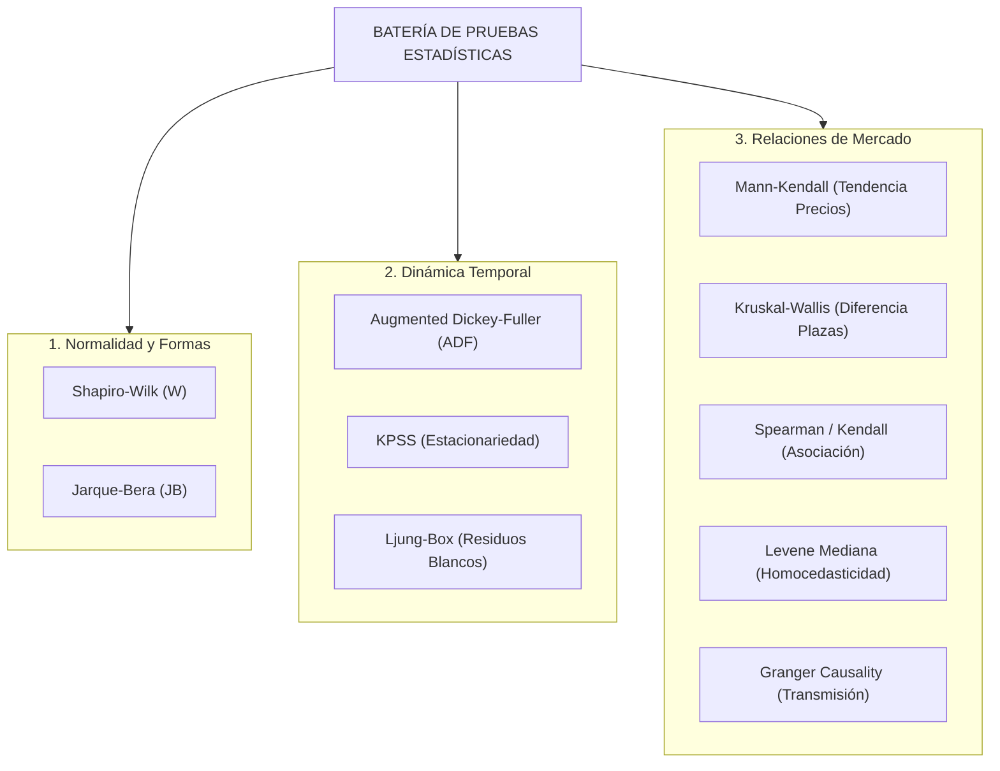

# Inspección Estadística — Parte II: Batería de Preguntas Agroindustriales, Pruebas Estadísticas y Armonización
**Proyecto**: AgroData Intelligence Platform (`AgroStatsApp`)  
**Versión**: 2.1.0  
**Fecha**: 2026-10-07  
**Fase PDCO**: PLAN → DEVELOPMENT  
**Enfoque**: Mercadeo Agroindustrial, Inteligencia de Mercados y Minería de Datos  
**Alcance**: Exclusivamente Agrícola y Agroindustrial (Sin sector pecuario)  

---

## 1. Punto 5: Batería de 25 Preguntas de Mercadeo Agroindustrial (A1 a J1)

Esta sección consolida y formaliza las 25 preguntas clave de inteligencia de mercados agroindustriales, integrando la matriz analítica dual (Paramétrica vs. No Paramétrica) e indicando la fuente de datos oficial correspondiente (sin ninguna referencia pecuaria):

| Código | Pregunta de Mercadeo Agroindustrial | Parámetro Principal | Fuente Oficial | CÓMO Paramétrico | CÓMO No Paramétrico (Robusto) |
|:---:|---|---|:---:|---|---|
| **A1** | ¿Cuál es el tamaño económico de cada mercado agroindustrial? | Valor total / Facturación | DANE (CSAA) | Suma de producción y ventas: $\sum V_i$ | Mediana ponderada de producción $\times$ Precio mediano |
| **A2** | ¿Qué cadenas agrícolas concentran mayor valor económico? | Participación de mercado | DANE (CSAA) | Participación porcentual: $s_i = V_i / \sum V$ | Participación de medoides ponderados |
| **A3** | ¿Qué cadenas agroindustriales presentan mayor dinamismo y crecimiento? | Tasa de crecimiento compuesto | DANE (CSAA) | $\text{CAGR} = (V_t/V_0)^{1/t} - 1$ | Pendiente Theil-Sen sobre logaritmo de ventas |
| **B1** | ¿Qué cultivos agrícolas presentan mayor volumen de producción? | Producción física (t) | UPRA (EVA Agrícola) | Promedio aritmético anual de cosechas ($\mu$) | Mediana de producción física ($\tilde{x}$) |
| **B2** | ¿Qué cultivos agrícolas expanden más su oferta física? | Variación de producción | UPRA (EVA Agrícola) | Variación porcentual interanual: $\Delta \%$ | Variación de la mediana interanual |
| **B3** | ¿Qué productos agrícolas presentan mayor estabilidad en el suministro? | Estabilidad de oferta | UPRA (EVA Agrícola) | Coeficiente de variación: $CV = \sigma / \mu$ | Dispersión robusta: $RSD = \text{IQR} / \text{Mediana}$ |
| **C1** | ¿Qué tan concentrada territorialmente está la producción agrícola? | Concentración espacial | UPRA (EVA Agrícola) | Índice Herfindahl-Hirschman: $HHI = \sum s_i^2$ | Coeficiente de Gini espacial sobre municipios |
| **C2** | ¿Qué municipios explican el núcleo de la oferta agrícola nacional? | Ratio de concentración | UPRA (EVA Agrícola) | Ratio de concentración de los 5 líderes ($CR_5$) | Porcentaje de la mediana acumulada en percentil 90 |
| **D1** | ¿Dónde existe brecha entre volumen cosechado y volumen abastecido a plazas? | Brecha oferta–mercado | UPRA + SIPSA | Tasa de brecha: $\text{Gap} = (\text{Oferta} - \text{Abasto}) / \text{Oferta}$ | Mediana de brechas municipales estandarizadas |
| **D2** | ¿Qué brechas comerciales son estructurales y persistentes en el tiempo? | Persistencia temporal | UPRA + SIPSA | Autocorrelación de la brecha $r_1$ (Lag-1) | Test de persistencia de rangos y rachas de Wald |
| **E1** | ¿Qué productos agrícolas presentan mayor volatilidad en precios mayoristas? | Volatilidad de precio | SIPSA Precios | Desviación estándar y $CV_{\text{precio}} = \sigma_P / \mu_P$ | Desviación absoluta respecto a la mediana ($MAD / \tilde{P}$) |
| **E2** | ¿Qué productos presentan tendencia alcista o bajista definida de precio? | Tendencia secular | SIPSA Precios | Pendiente de regresión lineal OLS ($\beta$) | Estimador de pendiente Theil-Sen ($\beta_{TS}$) |
| **E3** | ¿Existe relación cuantificable entre volumen de abasto y precio mayorista? | Elasticidad precio–oferta | SIPSA Abasto + Precios | Coeficiente de correlación de Pearson ($r$) | Correlación de Spearman ($\rho$) y Kendall ($\tau$) |
| **F1** | ¿Qué productos agrícolas presentan marcada estacionalidad de cosecha? | Índice estacional de oferta | SIPSA Abastecimientos | Descomposición clásica aditiva/multiplicativa | Descomposición robusta STL con LOESS |
| **F2** | ¿En qué meses se concentran los picos de precio alto para cada cultivo? | Ventana de precio pico | SIPSA Precios | Identificación de mes con $\mu_P$ máxima | Identificación de mes con mediana $\tilde{P}$ máxima |
| **G1** | ¿Qué cadenas agroindustriales generan mayor Valor Agregado Bruto (VAB)? | VAB absoluto | DANE (CSAA) | Suma de VAB industrial por cadena | Mediana de VAB sectorial |
| **G2** | ¿Qué cadenas generan mayor valor agregado relativo por tonelada procesada? | Productividad del valor | DANE (CSAA) | Ratio paramétrico: $\text{VAB} / \text{Producción}$ | Ratio de medianas: $\tilde{x}_{\text{VAB}} / \tilde{x}_{\text{Producción}}$ |
| **G3** | ¿En qué productos existe bajo grado de transformación agroindustrial? | Ratio de transformación | DANE (CSAA) | Ratio de consumo intermedio vs. producción bruta | Margen bruto de transformación mediano |
| **H1** | ¿Qué productos agroindustriales lideran las exportaciones en valor? | Valor FOB USD | DANE / DIAN (EXPO) | Suma total de exportaciones FOB (USD) | Mediana de facturación por operación de exportación |
| **H2** | ¿Qué subpartidas agrícolas crecen más aceleradamente en el exterior? | Crecimiento exportador | DANE / DIAN (EXPO) | CAGR de exportaciones FOB a 3 y 5 años | Pendiente Theil-Sen de exportaciones en logaritmos |
| **H3** | ¿Hacia qué países destino se expande más la demanda agroindustrial? | Dinamismo de destino | DANE / DIAN (EXPO) | Tasa de crecimiento por país comprador | Mediana de volumen transado por país destino |
| **H4** | ¿Qué productos agrícolas comercializan con mayor valor agregado exterior? | Valor unitario FOB/kg | DANE / DIAN (EXPO) | Precio implícito medio: $\sum \text{FOB} / \sum \text{kg}$ | Mediana del ratio unitario de exportación (USD/kg) |
| **I1** | ¿Cómo se correlaciona la producción agrícola en finca con el precio mayorista? | Cointegración campo-plaza | UPRA + SIPSA | Coeficiente de correlación de Pearson con rezago | Correlación por rangos de Spearman con rezago |
| **I2** | ¿Cómo responde el precio diario mayorista al volumen que ingresa al mercado? | Elasticidad de corto plazo | SIPSA Abasto + Precios | Regresión OLS log-log: $\ln(P_t) = \alpha + \beta \ln(Q_t)$ | Regresión cuantílica sobre mediana condicional ($q=0.5$) |
| **J1** | ¿Dónde convergen alto crecimiento, mercado atractivo y oferta disponible? | Índice multicriterio | Todas las fuentes | Índice Z-Score compuesto ponderado | Método multicriterio robusto TOPSIS / Rango percentil |

---

## 2. Punto 6: Batería de Pruebas Estadísticas Formales de Hipótesis

Para respaldar las decisiones comerciales y validar los modelos con rigor científico, el sistema ejecuta la siguiente batería estandarizada de pruebas:



| Prueba | Hipótesis Nula ($H_0$) | Hipótesis Alternativa ($H_1$) | Estadístico | Criterio de Rechazo ($\alpha=0.05$) | Uso en Mercadeo Agroindustrial |
|---|---|---|:---:|:---:|---|
| **Shapiro-Wilk** | $H_0$: Los precios/volúmenes provienen de población normal. | $H_1$: Divergencia de normalidad. | $W = \frac{(\sum a_i x_{(i)})^2}{\sum (x_i - \bar{x})^2}$ | $p < 0.05 \implies$ Activar Ruta Robusta. | Seleccionar entre media o mediana de precios. |
| **Jarque-Bera** | $H_0$: Asimetría $= 0$ y exceso de curtosis $= 0$. | $H_1$: Colas pesadas o sesgo. | $JB = \frac{n}{6}(S^2 + \frac{1}{4}(K-3)^2)$ | $JB > 5.99 \implies$ Rechazo gaussiano. | Evaluar colas de riesgo en cotizaciones. |
| **ADF Test** | $H_0$: La serie de precios tiene raíz unitaria (no estacionaria). | $H_1$: Es estacionaria $I(0)$. | $DF_\tau = \hat{\gamma} / \text{SE}(\hat{\gamma})$ | $p < 0.05 \implies$ Serie estacionaria. | Reversión a la media en cotizaciones de mercado. |
| **KPSS Test** | $H_0$: La serie es estacionaria en nivel o tendencia. | $H_1$: Raíz unitaria. | $LM = \sum S_t^2 / (T^2 \hat{\sigma}^2)$ | $LM > \text{crítico} \implies$ No estacionaria. | Confirmación cruzada con ADF. |
| **Ljung-Box** | $H_0$: Residuos de pronóstico sin autocorrelación serial. | $H_1$: Autocorrelación en residuos. | $Q = n(n+2)\sum \frac{\hat{\rho}_k^2}{n-k}$ | $p < 0.05 \implies$ Modelo sub-especificado. | Control de calidad en pronósticos de abasto. |
| **Mann-Kendall** | $H_0$: Sin tendencia monotónica en cotizaciones. | $H_1$: Tendencia alcista o bajista. | $S = \sum \sum \text{sgn}(x_j - x_k)$ | $|Z_{MK}| > 1.96 \implies$ Tendencia real. | Identificar encarecimiento estructural de productos. |
| **Kruskal-Wallis** | $H_0$: Las cotizaciones medianas son iguales entre plazas. | $H_1$: Al menos una plaza difiere. | $H = \frac{12}{N(N+1)}\sum \frac{R_i^2}{n_i} - 3(N+1)$ | $p < 0.05 \implies$ Segmentación de precios. | Identificar mercados caros vs. mercados baratos. |
| **Levene (Mediana)** | $H_0$: La volatilidad de precios es homogénea entre plazas. | $H_1$: Dispersión heterogénea. | $W = \frac{N-k}{k-1}\frac{\sum n_i(\bar{Z}_{i\cdot}-\bar{Z}_{\cdot\cdot})^2}{\sum \sum(Z_{ij}-\bar{Z}_{i\cdot})^2}$ | $p < 0.05 \implies$ Heterocedasticidad. | Evaluar riesgo comercial diferencial por ciudad. |
| **Spearman ($\rho$)** | $H_0$: Independencia entre volumen abastecido y precio. | $H_1$: Asociación monótona inversa. | $\rho = 1 - \frac{6\sum d_i^2}{n(n^2-1)}$ | $p < 0.05 \implies$ Elasticidad confirmada. | Demostrar ley económica de oferta y demanda. |
| **Granger Causality** | $H_0$: El precio en origen no causa al precio mayorista. | $H_1$: Precedencia temporal causal. | $F = \frac{(RSS_R - RSS_{UR})/m}{RSS_{UR}/(T-2m-1)}$ | $p < 0.05 \implies$ Transmisión temporal. | Medir rezago de transmisión de shocks. |

---

## 3. Armonización de Dimensionalidad y Granularidad Espaciotemporal

Para responder a las 25 preguntas sin incurrir en falacias ecológicas ni desalineación dimensional, el sistema implementa las siguientes reglas de consolidación:

### 3.1 Armonización Espacial
```
Nivel 1: Predio / Vereda Agrícola (UPRA EVA)
   │ (Agregación territorial)
   ▼
Nivel 2: Municipio DANE DIVIPOLA a 5 dígitos (e.g. 15759 Sogamoso, 25269 Facatativá)
   │ (Ruta de transporte y flujo logístico)
   ▼
Nivel 3: Central Mayorista de Abasto (e.g. Corabastos Bogotá, Cenabastos Cúcuta, Cavasa Cali)
   │ (Comercio exterior)
   ▼
Nivel 4: Puerto Marítimo / Frontera / Aduana DIAN (Buenaventura, Cartagena, Santa Marta)
```

### 3.2 Armonización Temporal
- **Diaria**: Precios mayoristas y registros de abastecimiento (SIPSA). Se utilizan directamente para volatilidad de corto plazo y alertas de mercado.
- **Mensual**: Frecuencia base de reconciliación macroeconómica. Las cotizaciones diarias se reducen a medianas mensuales y los volúmenes a sumas acumuladas, permitiendo el cruce con el IPC DANE y los índices de insumos de AgroNET.
- **Anual**: Producción de cosechas (UPRA EVA) y cuentas económicas (CSAA). Se proyectan o desagregan temporalmente utilizando perfiles estacionales históricos cuando se cruzan con datos mensuales.
