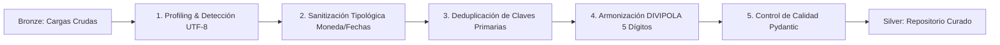

# Inspección Estadística — Parte IV: Curaduría de Datos, Manejo de Anomalías, Estándares y Productos
**Proyecto**: AgroData Intelligence Platform (`AgroStatsApp`)  
**Versión**: 2.1.0  
**Fecha**: 2026-10-07  
**Fase PDCO**: DEVELOPMENT → CONTROL  
**Estándares**: DAMA-DMBOK 2 (Calidad de Datos) / ISO/IEC 25010 / SWEBOK  
**Enfoque**: Mercadeo Agroindustrial y Minería de Datos (Sin sector pecuario)  

---

## 1. Punto 8: Protocolo de Curaduría de Datos (DAMA-DMBOK 2)

El protocolo de curaduría eleva la calidad de la información garantizando que los datos ingresados al Lakehouse cumplan con los 6 principios de calidad de datos del DAMA-DMBOK (Exactitud, Completitud, Consistencia, Integridad, Oportunidad y Unicidad):



### 1.1 Procedimientos Técnicos del Protocolo
1. **Detección y Conversión de Codificación**: Forzado de texto a UTF-8 estándar; erradicación de caracteres nulos (`\0`) y BOM (`\ufeff`).
2. **Sanitización y Coerción Numérica**: Eliminación de símbolos de divisa (`$`), puntos de miles (`.`) y conversión de coma decimal a punto flotante IEEE `float64`. Tipado de variables ordinales a enteros anulables `Int64`.
3. **Estandarización Temporal**: Normalización de marcas de tiempo a formato ISO-8601 (`YYYY-MM-DD`). Verificación de regularidad del intervalo temporal.
4. **Deduplicación de Claves Compuestas**: Identificación de duplicados exactos sobre las claves candidatas (e.g. en `sipsa_abastecimientos`: `[fecha, cod_mpio_origen, cod_mercado_destino, cod_producto]`), conservando la versión más reciente según timestamp de auditoría.
5. **Armonización Territorial DIVIPOLA DANE**: Resolución determinista de nombres de municipios y departamentos a códigos oficiales de 5 dígitos (e.g. `11001` Bogotá D.C., `05001` Medellín), resolviendo homónimos y errores tipográficos.
6. **Sellado Criptográfico**: Generación de hash SHA-256 de cada partición curada antes de la promoción a capas Silver y Gold.

---

## 2. Punto 9: Protocolo de Manejo de Anomalías y Tratamiento de Nulos

### 2.1 Tratamiento Algorítmico de los Nulos Auditados en la Base de Datos

```
                                          ┌── MAR (sipsa_precios) ───────► Imputación MICE / k-NN Ponderado + Flags
                                          │
                                          ├── MNAR (sipsa_insumos) ──────► Imputación Determinista Cero (fillna=0.0)
Mecanismo de Ausencia (Rubin 1976) ───────┤
                                          ├── Frontera (dane_ipc) ───────► Truncamiento Temporal de Ventana (t >= 13)
                                          │
                                          └── MCAR (ideam_telemetria) ───► Imputación Modal por Estación
```

#### A. Política para `sipsa_precios` (Nulos del 2.78% al 27.78% por plaza mayorista)
- **Mecanismo**: Ausencia condicionada (MAR). Si una plaza menor (e.g. Tunja o Armenia) no reporta cotización, su precio se correlaciona con las plazas de referencia (Corabastos, Centroabastos).
- **Algoritmo de Imputación**:
  1. Si el hueco temporal es de 1 o 2 periodos en una serie univariada: **Interpolación PCHIP** (Piecewise Cubic Hermite Interpolating Polynomial) para preservar la forma local.
  2. Para la matriz transversal completa: **Imputación Multivariada MICE (`IterativeImputer` con regresor `BayesianRidge`)** o **k-NN Ponderado ($k=5$)** con métrica de distancia de Gower.
  3. **Banderas de Auditoría Obligatorias**: Para cada columna imputada se generan:
     - `{col}_is_imputed`: Booleano (`True` si el valor fue estimado, `False` si es original).
     - `{col}_impute_algo`: String identificador (`"MICE_BAYESIAN"`, `"KNN_5"`, `"ORIGINAL"`).
  4. **Preservación de Varianza**: La desviación estándar posterior a la imputación debe cumplir:
     $$\left| \frac{\sigma_{\text{imputado}} - \sigma_{\text{original}}}{\sigma_{\text{original}}} \right| < 0.10$$

#### B. Política para `sipsa_insumos` (`total_otros`: 27.17% nulos)
- **Mecanismo**: MNAR (no devengado). Se aplica **imputación determinista a cero (`fillna(0.0)`)**, indicando en el catálogo de metadatos que la ausencia equivale a gasto cero en insumos no categorizados.

#### C. Política para `dane_ipc` (1 nulo mensual en $t_0$, 12 nulos anuales en $t_0 \dots t_{11}$)
- **Mecanismo**: Condición de frontera matemática del retardo $\Delta_{12} X_t$.
- **Tratamiento**: **No imputación**. Para modelos de variación interanual, se define una ventana muestral de análisis que inicia en la fila 13 ($t \ge 13$, enero de 2000 en adelante). Para variaciones mensuales se utiliza desde la fila 2 ($t \ge 2$).

#### D. Política para `ideam_telemetria_realtime` (2 cadenas vacías en sensores)
- **Mecanismo**: MCAR por ruido IoT. Imputación por el valor modal condicionado al `codigoestacion` y tipo de variable física.

---

### 2.2 Protocolo de Detección y Tratamiento de Valores Atípicos (Outliers)

En mercadeo agroindustrial, un precio muy alto o un volumen muy bajo puede representar un **choque real de oferta** (e.g. heladas, paro de transporte, sequía) o un **error de digitación**. El sistema distingue entre ambos:

1. **Detección Univariada Robusta**:
   - **Modified Z-Score con MAD**:
     $$M_i = \frac{0.6745 \cdot |x_i - \tilde{x}|}{\text{MAD}} \quad \implies \text{Alerta si } |M_i| > 3.5$$
   - **Criterio de Rango Intercuartílico (Tukey)**: Límites a $Q_1 - 1.5 \cdot \text{IQR}$ y $Q_3 + 1.5 \cdot \text{IQR}$.
2. **Detección Multivariada**:
   - **Isolation Forest**: Con hiperparámetros `contamination=0.01` y `n_estimators=150`, aislando combinaciones de precio-volumen atípicas.
3. **Tratamiento de Anomalías**:
   - **Errores Físicos**: Truncamiento a dominio admisible (precios $> 0$, precipitación $\ge 0$).
   - **Shocks Reales de Mercado**: **No se eliminan ni alteran**. Se procesan mediante el **Motor No Paramétrico / Robusto (Theil-Sen, Medianas, Huber)**, garantizando que el modelo sea resistente al outlier sin perder la señal de mercado.
   - **Winsorización al 1% y 99%**: Aplicada exclusivamente para modelos de optimización o redes neuronales que requieran estabilidad numérica en gradientes.

---

## 3. Punto 10: Estándares del Análisis Estadístico

1. **Significancia y Confianza**: Nivel nominal $\alpha = 0.05$ (confianza del 95%); nivel estricto $\alpha = 0.01$ (confianza del 99%) para contrastes de raíces unitarias y causalidad de Granger.
2. **Control de Comparaciones Múltiples**: Al contrastar hipótesis simultáneas sobre 10 plazas mayoristas o 50 productos, se aplica el procedimiento de **Benjamini-Hochberg (control de FDR)**:
   $$P_{(i)} \le \frac{i}{m} Q \quad (Q = 0.05)$$
3. **Métricas de Rendimiento y Bondad de Ajuste**:
   - Error porcentual absoluto medio ponderado: $\text{WAPE} = \frac{\sum |y_i - \hat{y}_i|}{\sum y_i}$ (métrica estándar en logística comercial).
   - Error cuadrático medio (RMSE) y Coeficiente de determinación ($R^2$ ajustado).
   - Parsimonia en modelos de series de tiempo mediante Criterios de Información de Akaike ($\text{AIC}$) y Bayesiano ($\text{BIC}$).
4. **Reproducibilidad Científica**: Fijación estricta de semillas deterministas (`random_state=42`) en todas las funciones pseudoaleatorias.

---

## 4. Punto 11: Productos y Entregables del Análisis

Los resultados se consolidan en artefactos estructurados y gobernados:
1. **Data Marts Analíticos (Capa Gold)**:
   - `mart_business_questions`: Respuestas cuantitativas a las 25 preguntas con valores duales (paramétrico y robusto) e intervalos de confianza.
   - Dimensiones analíticas maestras: [`dim_municipio_divipola`](file:///c:/Users/ADAN/OneDrive/Documentos/App_agro/AgroStatsApp/data/lakehouse/gold/dim_municipio_divipola.parquet) y [`dim_producto_agro`](file:///c:/Users/ADAN/OneDrive/Documentos/App_agro/AgroStatsApp/data/lakehouse/gold/dim_producto_agro.parquet).
2. **Catálogo de Metadatos Gobernado**: [`docs/statsdocs/dictionaries/data_catalog.md`](file:///c:/Users/ADAN/OneDrive/Documentos/App_agro/AgroStatsApp/docs/statsdocs/dictionaries/data_catalog.md) con esquemas, tipos y completitud bajo estándar DAMA-DMBOK 2.
3. **Reportes Automáticos de Calidad**: Repositorio [`docs/statsdocs/quality_reports/`](file:///c:/Users/ADAN/OneDrive/Documentos/App_agro/AgroStatsApp/docs/statsdocs/quality_reports/) con informes Markdown, JSON y gráficos matriciales de completitud `missingno`.
4. **Trazabilidad y Linaje**: Grafo DAG Mermaid en [`docs/swedocs/lineage/lineage_dag.md`](file:///c:/Users/ADAN/OneDrive/Documentos/App_agro/AgroStatsApp/docs/swedocs/lineage/lineage_dag.md) y manifiesto de ejecución `pipeline_run_manifest.json`.
5. **Artefactos de Modelos Serializados**: Modelos de pronóstico en `.joblib` en `models/` listos para inferencia en tiempo real.
6. **Interfaces de Consumo**: Cuadro de mando ejecutivo interactivo en [`app/dash/index.html`](file:///c:/Users/ADAN/OneDrive/Documentos/App_agro/AgroStatsApp/app/dash/index.html).
