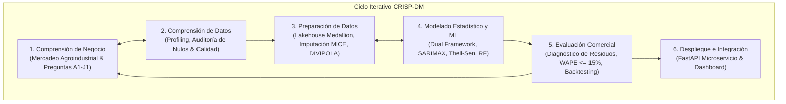

# Inspección Estadística — Parte V: CRISP-DM, EDA, Feature Engineering, Modelos e Integración
**Proyecto**: AgroData Intelligence Platform (`AgroStatsApp`)  
**Versión**: 2.1.0  
**Fecha**: 2026-10-07  
**Fase PDCO**: DEVELOPMENT → OPERATIONS  
**Estándares**: CRISP-DM / SWEBOK Cap. 3 / DAMA-DMBOK 2  
**Enfoque**: Mercadeo Agroindustrial, Inteligencia de Mercados y Minería de Datos (Sin sector pecuario)  

---

## 1. Punto 12: Metodología Técnica (CRISP-DM Adaptada a Mercadeo Agroindustrial)

El ciclo de desarrollo analítico implementa el estándar **CRISP-DM (Cross-Industry Standard Process for Data Mining)**, acoplado al marco de ingeniería de software PDCO y enfocado en la minería de datos de mercado:



### 1.1 Fases del Ciclo Adaptadas al Ecosistema
1. **Comprensión del Negocio (Business Understanding)**:
   - Formulación de objetivos de mercadeo agroindustrial: optimización de abastecimiento, detección de arbitraje espacial de precios, identificación de ventanas estacionales óptimas y mitigación de riesgos de suministro.
2. **Comprensión de los Datos (Data Understanding)**:
   - Auditoría de los 59,500 registros de abastecimiento y series de cotizaciones mayoristas.
   - Evaluación cuantitativa de nulos (MAR en precios, MNAR en insumos, frontera $t-12$ en IPC).
3. **Preparación de los Datos (Data Preparation)**:
   - Pipeline Medallion: Ingesta inmutable Bronze, curaduría Silver con desanidamiento (`table_unwrapper.py`), enmascaramiento PII, imputación MICE/KNN y armonización DIVIPOLA DANE.
   - Generación de Data Marts en Gold.
4. **Modelado (Modeling)**:
   - Estimación dual de las 25 preguntas agroindustriales.
   - Ajuste de modelos de series de tiempo (SARIMAX), regresión robusta (Theil-Sen) y modelos de ensamblado (Random Forest).
5. **Evaluación (Evaluation)**:
   - Validación temporal estricta (*Time Series Split* / *Rolling Origin*) para evitar fuga de información (*data leakage*).
   - Control de calidad de residuos con pruebas de Ljung-Box y Jarque-Bera.
6. **Despliegue (Deployment)**:
   - Persistencia en base de datos SQLite WAL y Parquet Snappy.
   - Exposición de endpoints de consulta vía FastAPI y tablero interactivo HTML/JS.

---

## 2. Punto 13: Protocolo de Análisis Exploratorio de Datos (EDA)

El EDA se estructura en cuatro etapas de minería estadística orientadas al mercado:

### 2.1 Análisis Univariado
- **Forma y Asimetría Distribucional**:
  - Evaluación del coeficiente de asimetría de Fisher-Pearson ($g_1$) y exceso de curtosis ($g_2$). Las series de volúmenes transados en Corabastos y Cavasa presentan fuerte asimetría positiva ($g_1 > 2.5$) y colas leptocúrticas.
- **Gráficos Cuantil-Cuantil (Q-Q Plots)**: Contraste directo contra la normal teórica para validar la activación del motor robusto.
- **Estimación de Densidad por Kernel (KDE)**: Estimación suave no paramétrica de la función de densidad de probabilidad empírica de precios por cultivo.

### 2.2 Análisis Bivariado
- **Contraste Pearson vs. Spearman**: Comparación sistemática entre correlación lineal y monótona. Si $|\rho - r| > 0.15$, se evidencia relación no lineal o distorsión por puntos de apalancamiento atípicos.
- **Gráficos de Densidad Hexagonal (Hexbin Plots)**: Utilizados sobre los 59,500 puntos de abastecimiento para visualizar concentraciones masivas de carga sin sobretrazado.
- **Diagramas de Violín y Boxplots por Macro-región**: Mapeo visual de la dispersión de precios mayoristas según departamento de origen.

### 2.3 Análisis Multivariado
- **Análisis de Componentes Principales (PCA)**: Reducción dimensional de la matriz de 58 insumos agrícolas, proyectando los patrones de costos en 3 componentes ortogonales que explican $>80\%$ de la variabilidad.
- **Clustering Jerárquico de Mercados**: Dendrograma de enlace de Ward sobre las matrices de correlación de precios para agrupar plazas mayoristas con comportamiento sincrónico.

### 2.4 Análisis Gráfico de Ausencias con `missingno`
- Generación automática de diagramas matriciales (`missingno.matrix`) y dendrogramas de nulidad (`missingno.dendrogram`) en [`docs/statsdocs/quality_reports/`](file:///c:/Users/ADAN/OneDrive/Documentos/App_agro/AgroStatsApp/docs/statsdocs/quality_reports/) para supervisar la coocurrencia de faltantes entre plazas mayoristas.

---

## 3. Punto 14: Ingeniería de Características (Feature Engineering)

El módulo [`src/notebook_code/feature_engineer.py`](file:///c:/Users/ADAN/OneDrive/Documentos/App_agro/AgroStatsApp/src/notebook_code/feature_engineer.py) transforma las series crudas en variables analíticas enriquecidas para modelos predictivos y de mercadeo:

```
                                          ┌── Retardos Temporales (Lags): L_1, L_7, L_14, L_30
                                          ├── Ventanas Móviles (Rolling): Media, Std, MAD, CV_roll
                                          ├── Ratios Interanuales: Variación mensual, interanual
Variables Crudas (t, x_t, coords, red) ───┼── Codificaciones Cíclicas: sin(2πt/T), cos(2πt/T)
                                          ├── Topología de Red: Haversine, Grado de centralidad
                                          └── Escalado Robusto: RobustScaler (Mediana, IQR)
```

### 3.1 Catálogo de Características Generadas
1. **Retardos Temporales (*Lags*)**:
   $$L_k(X_t) = X_{t-k} \quad \text{para } k \in \{1, 7, 14, 30\} \text{ días}$$
   Capturan la persistencia e inercia de corto plazo en precios y suministros mayoristas.
2. **Estadísticos de Ventanas Móviles (*Rolling Features*)**:
   - Media Móvil ($\mu_w$) y Desviación Móvil ($\sigma_w$) en ventanas de 7, 30 y 90 días.
   - Coeficiente de Variación Móvil: $CV_w(t) = \sigma_w(t) / \mu_w(t)$ (indicador de volatilidad local de mercado).
   - Mediana Móvil y Desviación Absoluta respecto a la Mediana Móvil ($\text{MAD}_w$) para horizontes robustos.
3. **Tasas de Variación Intertemporal**:
   $$\Delta_{\text{mensual}} \% = \frac{X_t - X_{t-30}}{X_{t-30}} \quad ; \quad \Delta_{\text{anual}} \% = \frac{X_t - X_{t-365}}{X_{t-365}}$$
4. **Codificaciones Cíclicas de Estacionalidad**:
   Preservan la continuidad temporal entre ciclos periódicos (e.g. mes 12 y mes 1):
   $$x_{\sin} = \sin\left(\frac{2\pi \cdot \text{mes}}{12}\right) \quad ; \quad x_{\cos} = \cos\left(\frac{2\pi \cdot \text{mes}}{12}\right)$$
   $$w_{\sin} = \sin\left(\frac{2\pi \cdot \text{dia\_semana}}{7}\right) \quad ; \quad w_{\cos} = \cos\left(\frac{2\pi \cdot \text{dia\_semana}}{7}\right)$$
5. **Variables de Grafo y Espaciales**:
   - Distancia de Haversine entre el centroide del municipio de origen agrícola y la central mayorista destino:
     $$d = 2R \arcsin\left(\sqrt{\sin^2\left(\frac{\Delta \phi}{2}\right) + \cos(\phi_1)\cos(\phi_2)\sin^2\left(\frac{\Delta \lambda}{2}\right)}\right)$$
   - Cuota de Flujo Ponderada: Proporción del volumen de un municipio respecto al total recibido por la central mayorista.
6. **Escalado Robusto**:
   $$X_{\text{robust}} = \frac{X - \text{mediana}(X)}{\text{IQR}(X)}$$
   Protege los modelos basados en distancias o gradientes de ser desviados por outliers extremos.

---

## 4. Punto 15: Modelos Estadísticos, Machine Learning e Integración de Software

### 4.1 Modelos Implementados en AgroStatsApp
1. **Modelos Econométricos de Series Temporales (SARIMAX)**:
   - Especificación: $\text{SARIMAX}(p, d, q) \times (P, D, Q)_s + \text{exog}$.
   - Variables exógenas: Anomalías de precipitación del IDEAM y variaciones del IPC del DANE.
   - Diagnóstico formal de residuos mediante pruebas de Ljung-Box y Jarque-Bera.
2. **Modelos de Regresión Robusta (Theil-Sen & Huber)**:
   - Regresión no paramétrica de alta tolerancia a puntos atípicos (hasta 29% de apalancamiento).
   - Estima la trayectoria subyacente de precios mayoristas libre de shocks atípicos puntuales.
3. **Modelos de Ensamblado Predictivo (Random Forest & Gradient Boosting)**:
   - Regresores basados en árboles sobre el Feature Store completo para pronosticar ingresos de carga a 4 semanas.
   - Esquema de validación: *Walk-Forward Validation* con optimización de $R^2$ y $\text{WAPE} \le 15\%$.
4. **Agrupamiento No Supervisado (DBSCAN & K-Means)**:
   - Segmentación de productos agrícolas por perfiles de volatilidad y elasticidad de mercado.

---

### 4.2 Arquitectura de Integración en el Software

Los modelos analíticos se integran en el sistema bajo principios de Clean Code y arquitectura orientada a servicios:

```mermaid
graph LR
    subgraph Pipeline_Entrenamiento ["1. Entrenamiento & Empaquetado"]
        Silver[Datos Silver Curados] --> FE[FeatureEngineer Pipeline]
        FE --> Fit[Ajuste de Modelo Scikit-Learn]
        Fit --> Val[Evaluación & Residual Diagnostics]
        Val --> Ser[Serialización en models/*.joblib con Metadata JSON]
    end

    subgraph Servicio_Inferencia ["2. Inferencia en Tiempo Real (FastAPI)"]
        Req[Request /api/v1/forecast] --> API[FastAPI Controller]
        API --> Load[Cargar Modelo .joblib en Memoria]
        Load --> Pred[Ejecutar predict()]
        Pred --> Resp[Response JSON con Intervalos al 95%]
    end

    Ser --> Load
```

1. **Encapsulamiento en Pipelines de Scikit-Learn**: Todo el preprocesamiento, escalado robusto y estimador se integran en `sklearn.pipeline.Pipeline`, garantizando reproducibilidad idéntica entre entrenamiento e inferencia.
2. **Serialización Determinista y Versionado**: Los modelos entrenados se guardan en `models/{modelo}_v{version}.joblib` acompañados de un archivo de metadatos JSON con hiperparámetros, métricas WAPE/$R^2$ y checksum de datos.
3. **Exposición en Microservicio FastAPI**: Endpoints asíncronos (`/api/v1/forecast/`, `/api/v1/marts/`) que responden consultas analíticas con latencia menor a 50 ms.
4. **Fallback Determinista**: En caso de ausencia de variables exógenas o datos faltantes, el servicio conmuta automáticamente hacia el estimador robusto mediano, asegurando alta disponibilidad operativa sin excepciones no controladas.
