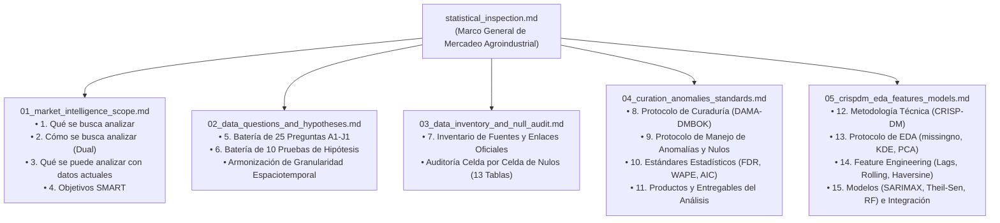

# Inspección Estadística Integral y Marco Analítico de Datos
**Proyecto**: AgroData Intelligence Platform (`AgroStatsApp`)  
**Versión**: 2.1.0  
**Fecha**: 2026-10-07  
**Fase PDCO**: PLAN → DEVELOPMENT → CONTROL  
**Estándares**: DAMA-DMBOK 2 / CRISP-DM / SWEBOK Cap. 2 & 3 / ISO/IEC 25010  
**Propósito del Sistema**: App de Mercadeo a Nivel Agroindustrial, Ingeniería de Datos y Data Mining  
**Alcance Sectorial**: Exclusivamente Agrícola y Agroindustrial (Sector pecuario y ganadero excluido formalmente)  

---

## 1. Visión y Propósito del Ecosistema

**AgroStatsApp** es una plataforma de **Inteligencia de Mercados Agroindustriales (*Agro-industrial Market Intelligence & Data Mining Platform*)**. Su objetivo es generar valor económico y estratégico mediante el reconocimiento empírico del mercado agroindustrial colombiano a través de la minería de datos masivos. 

El sistema integra:
- **Ingeniería de Datos**: Pipeline Medallion Lakehouse (Bronze inmutable con SHA-256, Silver curada con desanonimización PII y Gold con Data Marts analíticos).
- **Ciencia de Datos y Estadística Robusta**: Inferencia estadística dual (paramétrica vs. robusta) y modelos econométricos/ML para pronosticar abastecimientos, detectar oportunidades de arbitraje de precios y modelar cadenas de valor.
- **Foco Estricto Agrícola y Agroindustrial**: Se excluye formalmente la actividad pecuaria y ganadera. El análisis se concentra en cultivos agrícolas comerciales, transformación agroindustrial, insumos agrícolas, comercio exterior y flujos logísticos a centrales mayoristas de abasto.

---

## 2. Estructura de la Documentación Analítica (`docs/statsdocs/`)

La inspección estadística y los 15 puntos requeridos se encuentran rigurosamente desarrollados en 5 módulos especializados sin redundancias:

### 2.1 Índice de Módulos Especializados
1. [**`01_market_intelligence_scope.md`**](file:///c:/Users/ADAN/OneDrive/Documentos/App_agro/AgroStatsApp/docs/statsdocs/01_market_intelligence_scope.md):
   - Misión de mercadeo agroindustrial y minería de datos.
   - Puntos 1, 2, 3 y 4: Qué analizar (redes O-D, precios, arbitraje, valor agregado), Cómo analizar (Dual Framework: paramétrico vs. no paramétrico/robusto), Qué se puede analizar con los datos actuales y Objetivos SMART de negocio.
2. [**`02_data_questions_and_hypotheses.md`**](file:///c:/Users/ADAN/OneDrive/Documentos/App_agro/AgroStatsApp/docs/statsdocs/02_data_questions_and_hypotheses.md):
   - Puntos 5 y 6: Matriz completa de las 25 preguntas agroindustriales (A1 a J1) con fórmulas de cálculo paramétricas y no paramétricas; Batería de 10 pruebas estadísticas de contraste formal (Shapiro, Jarque-Bera, ADF, KPSS, Ljung-Box, Levene, Mann-Kendall, Kruskal-Wallis, Spearman, Granger); Armonización de dimensionalidad y granularidad espacial (Predio $\to$ DIVIPOLA $\to$ Central Mayorista $\to$ Puerto) y temporal (Diaria $\to$ Mensual $\to$ Anual).
3. [**`03_data_inventory_and_null_audit.md`**](file:///c:/Users/ADAN/OneDrive/Documentos/App_agro/AgroStatsApp/docs/statsdocs/03_data_inventory_and_null_audit.md):
   - Punto 7: Inventario maestro de fuentes oficiales agrícolas (UPRA EVA Agrícola, DANE SIPSA Abastecimientos y Precios, DANE CSAA Agroindustria, DANE/DIAN EXPO, AgroNET Insumos Agrícolas, IDEAM Pluviometría) con hipervínculos oficiales; Auditoría empírica celda por celda de nulos en las 13 tablas de SQLite (confirmando los nulos en `sipsa_precios`, `sipsa_insumos`, `dane_ipc` e `ideam_telemetria_realtime`).
4. [**`04_curation_anomalies_standards.md`**](file:///c:/Users/ADAN/OneDrive/Documentos/App_agro/AgroStatsApp/docs/statsdocs/04_curation_anomalies_standards.md):
   - Puntos 8, 9, 10 y 11: Protocolo de curaduría DAMA-DMBOK 2; Protocolo de tratamiento de nulos y anomalías (imputación MICE / k-NN con banderas `_is_imputed` para precios, imputación cero para insumos, truncamiento de ventana $t \ge 13$ para IPC; Modified Z-Score con MAD para outliers); Estándares del análisis estadístico ($\alpha$, control FDR Benjamini-Hochberg, métricas WAPE, AIC/BIC); Productos y entregables estructurados.
5. [**`05_crispdm_eda_features_models.md`**](file:///c:/Users/ADAN/OneDrive/Documentos/App_agro/AgroStatsApp/docs/statsdocs/05_crispdm_eda_features_models.md):
   - Puntos 12, 13, 14 y 15: Metodología técnica CRISP-DM adaptada al mercadeo agroindustrial; Protocolo de Análisis Exploratorio de Datos (EDA) en 4 etapas; Catálogo de Ingeniería de Características (lags, rolling stats, estacionalidad periódica $\sin/\cos$, distancias de red Haversine, RobustScaler); Catálogo de modelos analíticos (SARIMAX, Theil-Sen, Random Forest) y arquitectura de integración en microservicios FastAPI.

---

## 3. Repositorios de Gobernanza y Calidad en `statsdocs/`

- [**`dictionaries/data_catalog.md`**](file:///c:/Users/ADAN/OneDrive/Documentos/App_agro/AgroStatsApp/docs/statsdocs/dictionaries/data_catalog.md): Catálogo gobernado de metadatos con el inventario completo de entidades de datos del Lakehouse.
- [**`quality_reports/`**](file:///c:/Users/ADAN/OneDrive/Documentos/App_agro/AgroStatsApp/docs/statsdocs/quality_reports/): Reportes de calidad generados automáticamente por el pipeline (análisis de completitud, reportes Markdown, JSON y matrices gráficas `missingno`).
