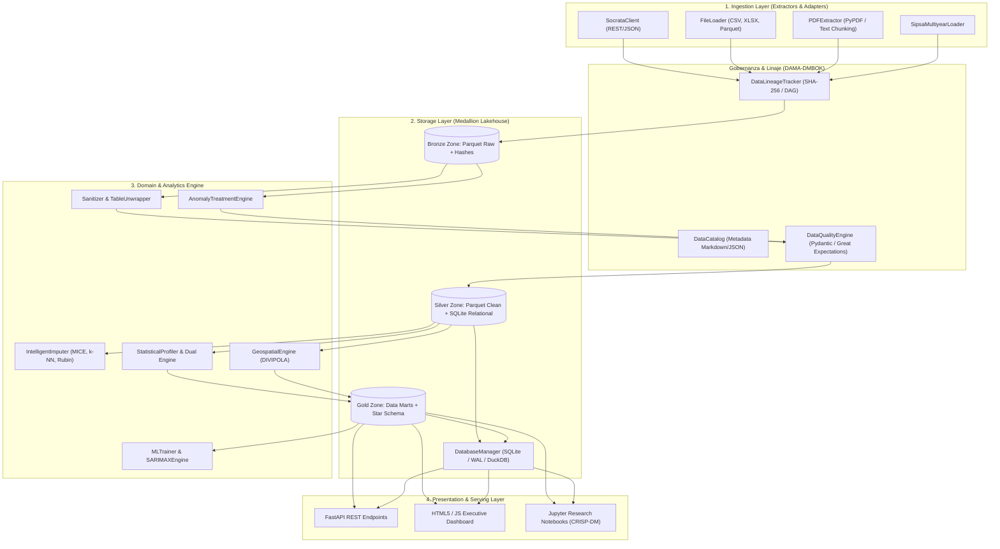
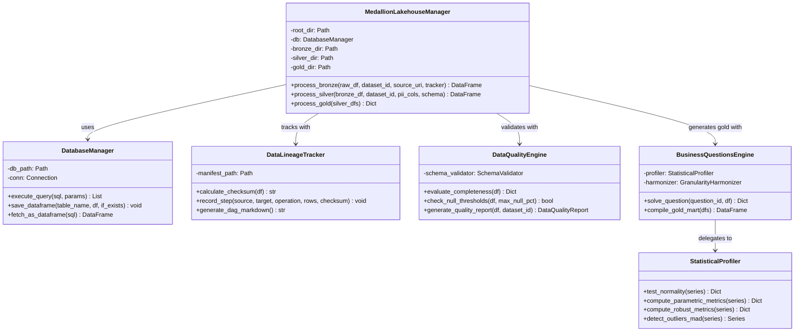
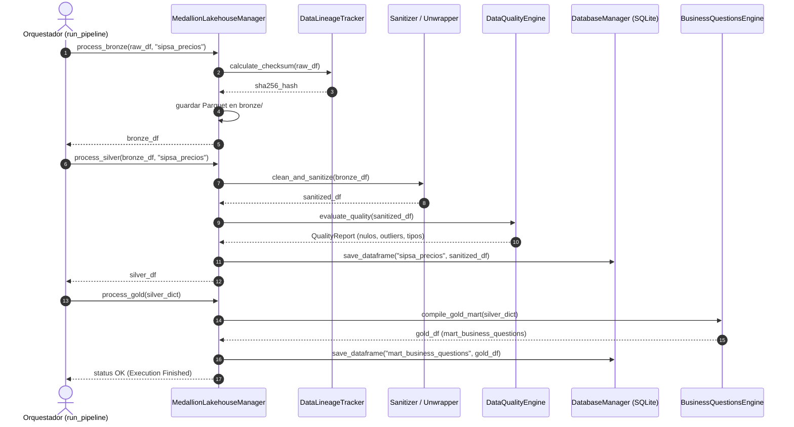

# Documento de Arquitectura de Software (SAD)
**Proyecto**: AgroStats Intelligence Platform (`AgroStatsApp`)  
**Versión**: 2.1.0  
**Fecha**: 2026-10-07  
**Fase PDCO**: PLAN → DEVELOPMENT  
**Estándar**: SWEBOK Cap. 2 / ISO/IEC/IEEE 42010 / DAMA-DMBOK 2  

---

## 1. Visión General de la Arquitectura

La arquitectura de **AgroStatsApp** está concebida como un sistema híbrido que combina la **Arquitectura Medallion Lakehouse** (Bronze $\rightarrow$ Silver $\rightarrow$ Gold) con los principios de **Clean Architecture (Hexagonal / Ports & Adapters)**. Esta combinación asegura desacoplamiento total entre los mecanismos de persistencia física (Parquet, DuckDB, SQLite), la infraestructura de ingesta de datos (APIs externas, scrapers, sistemas de archivos) y el núcleo de dominio analítico (motores de cálculo estadístico dual, validación de reglas de calidad y modelos predictivos).

El sistema prioriza:
1. **Inmutabilidad y Auditoría**: Preservación criptográfica de entradas crudas.
2. **Eficiencia y Baja Latencia**: Almacenamiento columnar comprimido (Snappy) para analítica masiva y motor relacional ACID embebido (SQLite con WAL) para acceso transaccional y consultas de baja latencia.
3. **Robustez Matemática**: Capa de computación estadística desacoplada capaz de alternar entre estimadores paramétricos y no paramétricos sin modificar los esquemas de persistencia.

---

## 2. Diagramas Arquitectónicos (C4 & UML)

### 2.1 Diagrama de Componentes del Sistema

### 2.2 Diagrama de Clases del Núcleo del Sistema

### 2.3 Diagrama de Secuencia: Flujo de Procesamiento y Calidad

---

## 3. Catálogo de Patrones Aplicados

### 3.1 Patrones GoF (Gang of Four)
1. **Factory Method (Creacional)**:
   - *Componente*: `src/ingestion/file_loader.py` e `imputer/ingestion/dataset_registry.py`.
   - *Problema*: La ingesta procesa heterogéneamente Parquet, CSV, Excel y JSON según la extensión del archivo sin acoplar el llamador con clases concretas de parsing.
2. **Strategy (Comportamiento)**:
   - *Componente*: `src/modeling/statistical_profiler.py` y `src/imputer/imputation/algorithms.py`.
   - *Problema*: Los algoritmos de estimación (Paramétrico vs. Robusto) y de imputación (MICE, k-NN, Interpolación Temporal, Mediana Condicional) son intercambiables en tiempo de ejecución según el diagnóstico de Rubin (MCAR/MAR/MNAR).
3. **Facade (Estructural)**:
   - *Componente*: `src/lakehouse/lakehouse_manager.py`.
   - *Problema*: Simplifica la interacción con múltiples subsistemas complejos (linaje, PII, validación de esquemas, compresión Parquet y persistencia en SQLite) a través de tres métodos elementales: `process_bronze`, `process_silver` y `process_gold`.
4. **Adapter (Estructural)**:
   - *Componente*: `src/cleaning/table_unwrapper.py`.
   - *Problema*: Adapta matrices anchas multidimensionales no tabulares emitidas por DANE/SIPSA hacia DataFrames tabulares normalizados en formato *tidy* ($N \times M$).

### 3.2 Patrones GRASP
1. **Information Expert**:
   - `DataQualityEngine` contiene la metadata de las reglas de validación y es el responsable de calcular el porcentaje de completitud y declarar si un dataset aprueba o no el quality gate.
2. **Controller**:
   - `MedallionLakehouseManager` y `run_pipeline.py` orquestan los casos de uso sin asumir la lógica de bajo nivel de conversión de tipos o parsing de cadenas.
3. **Low Coupling & High Cohesion**:
   - Cada módulo dentro de `src/` opera sobre contratos explícitos de DataFrames de Pandas/PyArrow sin dependencias cíclicas hacia otros componentes de infraestructura.

---

## 4. Validación de Principios SOLID

| Principio | Componente Evaluado | Cumplimiento y Evidencia |
|---|---|---|
| **S** - Single Responsibility | `src/cleaning/sanitizer.py` | Exclusivamente responsable de normalizar cadenas de texto, formatos de fecha y conversiones numéricas. No realiza I/O ni persiste en base de datos. |
| **O** - Open/Closed | `src/imputer/imputation/algorithms.py` | La clase abstracta `BaseImputationAlgorithm` permite añadir nuevos estimadores sin modificar el motor de resolución `ImputationEngine`. |
| **L** - Liskov Substitution | `src/ingestion/base_client.py` y `socrata_client.py` | Cualquier cliente de datos que herede de la interfaz base puede sustituirse sin alterar el flujo de llamadas de los consumidores. |
| **I** - Interface Segregation | `src/governance/lineage.py` | La interfaz de linaje solo expone métodos necesarios para el registro de pasos y cómputo de checksums, evitando sobrecargarla con responsabilidades de catalogación textual. |
| **D** - Dependency Inversion | `MedallionLakehouseManager` | Depende de la abstracción `DatabaseManager` y no de drivers directos o cadenas de conexión empotradas. |

---

## 5. Prevención y Erradicación de Antipatrones

- **God Object**: Erradicado. El pipeline no concentra toda la lógica en un solo script; delega a 7 subsistemas especializados (`ingestion`, `cleaning`, `validation`, `database`, `lakehouse`, `governance`, `modeling`).
- **Magic Numbers**: Erradicado. Umbrales de calidad ($z$-score $> 3.0$, $IQR \times 1.5$, $\alpha = 0.05$, max nulls $= 0.30$) centralizados en constantes y configuraciones YAML.
- **Hard Coding**: Erradicado. Rutas de datasets, IDs de recursos Socrata y parámetros de base de datos definidos en `config/datasets_config.yaml` y `.env`.
- **Lava Flow**: Erradicado. La suite completa de 23 tests automatizados valida que no exista código muerto y que todas las funciones exportadas mantengan cobertura activa.

---

## 6. Architecture Decision Records (ADRs)

### ADR-001: Adopción de Almacenamiento Híbrido Parquet (Medallion) + SQLite WAL
- **Estado**: Aceptado
- **Contexto**: El sistema requiere almacenar series temporales extensas (decir, 59,500 registros de abastecimiento y matrices de precios) con alta eficiencia de compresión y al mismo tiempo proveer una interfaz SQL estándar para consumo interactivo y pruebas.
- **Decisión**: Utilizar Parquet Snappy en el Lakehouse (Bronze, Silver, Gold) como fuente de verdad columnar inmutable, y sincronizar las tablas Silver/Gold en una base SQLite local configurada con `journal_mode=WAL`.
- **Consecuencias**:
  - *Positivas*: Máxima velocidad en operaciones analíticas vectorizadas; compresión superior al 60%; portabilidad sin levantar servicios externos.
  - *Negativas*: Ligero sobrecosto de tiempo de escritura al duplicar el mart en Parquet y SQLite.

### ADR-002: Dual Statistical Framework (Paramétrico y No Paramétrico)
- **Estado**: Aceptado
- **Contexto**: Los datos empíricos de transacciones de mercado y pluviometría presentan frecuentemente asimetría positiva severa, valores atípicos por fenómenos extremos y ausencia de normalidad gaussiana.
- **Decisión**: Ningún cálculo agregado debe limitarse a la media aritmética y desviación estándar. Para cada pregunta de negocio se debe computar en paralelo la métrica paramétrica ($\mu, \sigma$, Pearson, OLS) y la métrica robusta (Mediana, MAD/IQR, Spearman, Theil-Sen), diagnosticando la normalidad mediante pruebas formales.
- **Consecuencias**:
  - *Positivas*: Conclusiones analíticas insensibles al sesgo de outliers; robustez en la toma de decisiones.
  - *Negativas*: Doble costo computacional de cálculo, mitigado mediante vectorización en NumPy/SciPy.
