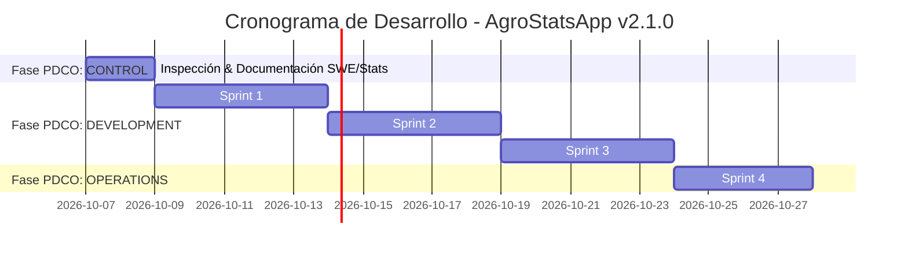

# Plan de Desarrollo de Software (DevPlan)
**Proyecto**: AgroStats Intelligence Platform (`AgroStatsApp`)  
**Versión**: 2.1.0  
**Fecha**: 2026-10-07  
**Fase PDCO**: DEVELOPMENT → CONTROL  
**Estándar**: SWEBOK / IEEE 1074 / ISO/IEC 12207  

---

## 1. Auditoría del Estado Actual del Sistema: Qué Hay, Qué Falta y De Qué Forma

Para asegurar una planeación precisa y fundamentada en la realidad técnica del repositorio, se realizó una inspección exhaustiva de los activos existentes, brechas arquitectónicas y anomalías en las bases de datos.

### 1.1 Inventario de lo que HAY (Activos Implementados)
1. **Pipeline Lakehouse Medallion**:
   - `src/lakehouse/lakehouse_manager.py`: Orquestador funcional de capas Bronze (Parquet crudo + SHA-256), Silver (Parquet limpio + SQLite) y Gold (Data Marts y Modelo Estrella).
   - `run_pipeline.py`: Script de ejecución con carga automatizada de 9 fuentes de datos.
2. **Base de Datos y Almacenamiento Columnar**:
   - Base de datos SQLite operativa (`data/processed/agrostats_lakehouse.db`, 13.6 MB) con 13 tablas consolidadas y 59,500 registros longitudinales en abastecimiento.
   - Directorios Parquet completos en `data/lakehouse/bronze`, `data/lakehouse/silver` y `data/lakehouse/gold`.
3. **Módulos de Limpieza y Calidad**:
   - `src/cleaning/sanitizer.py`, `table_unwrapper.py`, `pii_handler.py`, `anomaly_treatment.py`.
   - `src/validation/quality_engine.py`: Motor generador de reportes de calidad Markdown, JSON y gráficos matriciales de nulos (`missingno`).
4. **Módulos de Modelado e Imputación**:
   - `src/imputer/`: Motor avanzado con diagnósticos de Rubin (MCAR/MAR/MNAR) y torneos de imputación (KNN, MICE, Interpolación).
   - `src/modeling/business_questions_engine.py`: Motor analítico que implementa el framework dual paramétrico y no paramétrico para 25 preguntas.
   - `src/notebook_code/`: Suite desacoplada de utilidades para notebooks de investigación CRISP-DM.
5. **Aseguramiento de Calidad**:
   - Suite de 23 tests automatizados con `pytest` pasando al 100% en `tests/`.

### 1.2 Diagnóstico de lo que FALTA y De Qué Forma Abordarlo
| # | Componente | Qué Falta | De Qué Forma Abordarlo |
|:---:|---|---|---|
| **1** | **Tratamiento de Nulos en Base de Datos** | La tabla `sipsa_precios` presenta entre 11% y 27.8% de nulos por plaza; `sipsa_insumos` tiene 27.2% de nulos en `total_otros`; `dane_ipc` tiene 12 nulos en variación anual; `ideam_telemetria_realtime` tiene strings vacíos en sensores. | Integrar `src/imputer` directamente en el pipeline de `run_pipeline.py`. Aplicar MICE / KNN a precios mayoristas con flag de auditoría `_is_imputed` y documentar la condición de frontera ($t-12$) en IPC. |
| **2** | **Capa de Servicios (Serving Layer)** | Falta una API REST estructurada que exponga los Data Marts y resultados estadísticos para consumo externo. | Desarrollar `app/api/main.py` con FastAPI y endpoints `/api/v1/marts/`, `/api/v1/stats/`, `/api/v1/quality/`. |
| **3** | **Automatización de Inferencia Estadística** | Las pruebas de normalidad (Shapiro-Wilk) y estacionariedad (ADF/KPSS) están en código de notebooks pero no se ejecutan como un servicio por lotes con persistencia en Gold. | Crear `src/modeling/hypothesis_testing_engine.py` que persista una tabla `gold_statistical_tests` con estadísticos de contraste, $p$-values y decisiones de rechazo $H_0$. |
| **4** | **Serialización de Modelos Predictivos** | Los modelos de series temporales (SARIMAX) y regresión robusta (Theil-Sen) se ajustan en caliente pero no se serializan como artefactos versionados. | Implementar un gestor de modelos (`ModelRegistry`) con serialización en `models/` mediante `joblib` y metadata de entrenamiento. |
| **5** | **CI/CD Automatizado** | Falta el workflow de GitHub Actions para linting (Ruff/Flake8), testing y validación de esquemas en cada Pull Request. | Crear `.github/workflows/ci.yml`. |

---

## 2. Plan de Sprints (Fases PDCO y SDLC)

### Sprint 1: Curaduría Avanzada y Erradicación de Nulos en Base de Datos
- **Objetivo**: Conectar el motor de imputación de `src/imputer` a la ingesta principal para eliminar nulos en capas Silver y Gold.
- **Tareas**:
  - `TSK-101`: Modificar `run_pipeline.py` para invocar `IntelligentImputer` en `sipsa_precios` y `sipsa_insumos`.
  - `TSK-102`: Añadir regla de sanitización en `DataSanitizer` para convertir cadenas vacías `""` o `"None"` a valores tipados o imputados en `ideam_telemetria_realtime`.
  - `TSK-103`: Documentar explícitamente en el catálogo la condición de frontera de `dane_ipc` (12 meses sin variación interanual).
  - `TSK-104`: Generar nuevos reportes de calidad post-imputación en `docs/quality_reports/`.

### Sprint 2: Motor Estadístico Formal e Inferencia Automatizada
- **Objetivo**: Consolidar la batería formal de pruebas de hipótesis y estimación multivariada.
- **Tareas**:
  - `TSK-201`: Crear clase `HypothesisTestingEngine` en `src/modeling/` (Shapiro-Wilk, Jarque-Bera, ADF, KPSS, Mann-Kendall, Kruskal-Wallis, Levene).
  - `TSK-202`: Generar mart `mart_hypothesis_tests` en capa Gold con resultados a nivel de confianza del 95% y 99%.
  - `TSK-203`: Añadir tests unitarios en `tests/test_hypothesis_testing.py`.

### Sprint 3: Capa de Servicios y API REST (FastAPI)
- **Objetivo**: Exponer los marts analíticos y los motores estadísticos mediante una API moderna y documentada.
- **Tareas**:
  - `TSK-301`: Implementar `app/api/main.py` con FastAPI, Pydantic v2 schemas y CORS configurado.
  - `TSK-302`: Crear endpoints `/api/v1/questions/` (las 25 preguntas resueltas) y `/api/v1/quality/reports/`.
  - `TSK-303`: Conectar el dashboard HTML/JS existente en `app/dash/` para consumir los endpoints dinámicamente.

### Sprint 4: CI/CD, Monitoreo y Mantenimiento Operacional
- **Objetivo**: Garantizar calidad continua, reproducibilidad y gobernanza operativa.
- **Tareas**:
  - `TSK-401`: Crear pipeline `.github/workflows/ci.yml` ejecutando `ruff check` y `pytest --cov`.
  - `TSK-402`: Actualizar `metadata.json` y el linaje de datos tras cada build exitoso.
  - `TSK-403`: Configurar alertas de drift de datos y umbrales de integridad.

---

## 3. Matriz de Riesgos y Control de Deuda Técnica

| Riesgo / Deuda Técnica | Severidad | Probabilidad | Impacto | Estrategia de Mitigación |
|---|:---:|:---:|---|---|
| **Dispersión en Matrices de Precios** | Alta | Alta | Los modelos predictivos fallan si reciben NaNs. | Implementar algoritmo MICE con diagnóstico de Little (MCAR) para asegurar que la imputación no distorsione la covarianza. |
| **Desfase en Granularidad Espacial** | Media | Alta | Pérdida de precisión al agregar de estación puntual a municipio. | Utilizar el mapeo determinista DIVIPOLA y preservar coordenadas geográficas para análisis geoestadísticos finos. |
| **Bloqueo en SQLite por Concurrencia** | Media | Baja | Fallo de escritura si la API lee mientras el pipeline escribe. | Activar de forma obligatoria `PRAGMA journal_mode = WAL` y `PRAGMA busy_timeout = 5000`. |
| **Drift en Esquemas Externos (Socrata)** | Media | Media | Falla de ingesta si la entidad gubernamental renombra columnas. | Envolver llamadas en `SchemaValidator` con validación suave (*soft failure*) y fallback a la última versión válida de Bronze. |
