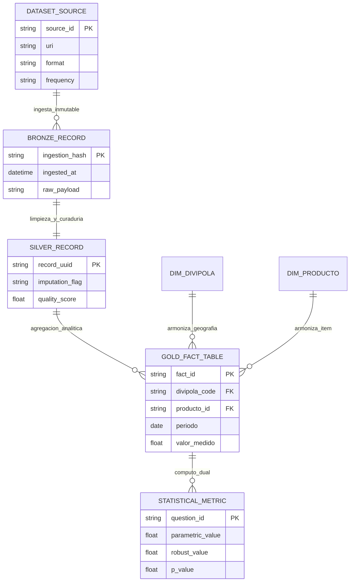
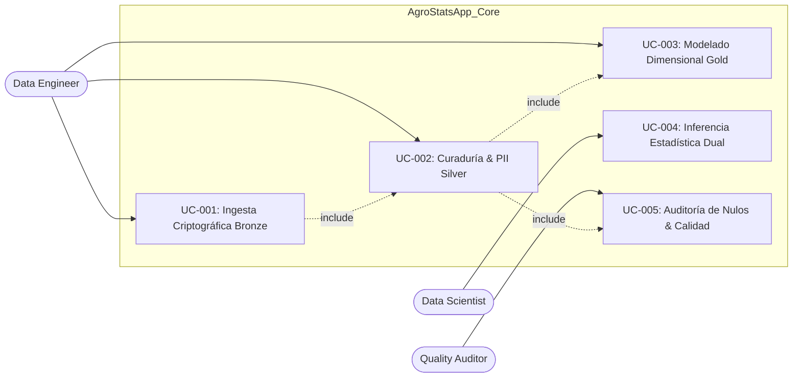
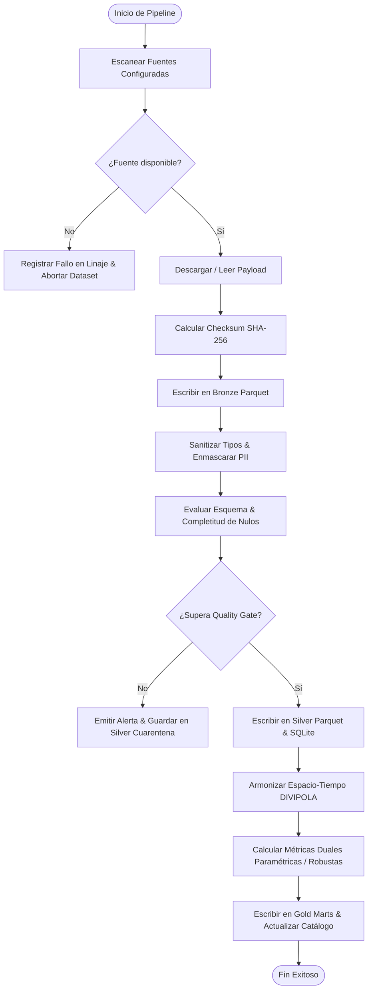

# Especificación de Requerimientos de Software (SRS)
**Proyecto**: AgroStats Intelligence Platform (`AgroStatsApp`)  
**Versión**: 2.1.0  
**Fecha**: 2026-10-07  
**Fase PDCO**: PLAN  
**Estándar**: IEEE 830 / ISO 29148 / SWEBOK Cap. 1  

---

## 1. Introducción y Propósito del Sistema

### 1.1 Propósito
El propósito del sistema **AgroStatsApp** es proveer una plataforma integral de ingeniería de datos, gobernanza, análisis estadístico multivariado y modelado analítico basada en arquitectura Medallion Lakehouse (Bronze, Silver, Gold). El sistema transforma flujos heterogéneos y dispersos de datos tabulares, semiestructurados y no estructurados en repositorios analíticos de alta integridad, garantizando trazabilidad criptográfica, curaduría de datos y capacidades de inferencia paramétrica y no paramétrica.

### 1.2 Alcance del Sistema
El sistema abarca:
1. Ingestión resiliente multi-fuente (APIs Socrata REST, archivos Parquet, CSV, Excel, microdatos estadísticos y documentos PDF).
2. Arquitectura de almacenamiento Medallion con inmutabilidad y sellado criptográfico SHA-256 en capa Bronze.
3. Tratamiento de calidad de datos, remoción de PII, sanitización tipológica y armonización espacial DIVIPOLA en capa Silver.
4. Construcción de Data Marts analíticos y modelos estrella en capa Gold persistidos en DuckDB/Parquet y SQLite.
5. Motor de resolución analítica de baterías de preguntas mediante estimación dual (paramétrica y robusta/no paramétrica).
6. Catálogo de datos automatizado, linaje de transformación y reportes de calidad con diagnósticos de completitud.

---

## 2. Segmentación del Problema y Mapa de Entidades

### 2.1 Segmentación del Problema
- **Problema que resuelve**: Fragmentación, alta tasa de dispersión, discontinuidad temporal, presencia de valores faltantes (nulos estructurales de hasta 28% en cotizaciones de mercado) y asimetría distribucional en datasets analíticos.
- **Cómo lo resuelve**: Implementando un pipeline determinista y auditable con arquitectura Medallion Lakehouse, políticas rigurosas de imputación/curaduría, validación Pydantic y un motor estadístico dual.
- **Dominio**: Procesamiento analítico de datos multidimensionales, series temporales, matrices de precios espaciales y flujos logísticos origen-destino.

### 2.2 Entidades del Sistema

---

## 3. Casos de Uso del Sistema (Use Cases by Entity)

### UC-001: Ingesta Criptográfica y Preservación Bronze
- **Actor**: Pipeline Scheduler / Data Engineer
- **Precondición**: Fuente de datos accesible vía filesystem local o API HTTP/Socrata.
- **Flujo Principal**:
  1. El extractor adquiere el dataset crudo mediante cliente HTTP o parser de archivo.
  2. El sistema computa el hash criptográfico SHA-256 de la carga útil (*payload*).
  3. El sistema añade metadatos de linaje (`_ingested_at`, `_source_uri`, `_checksum`).
  4. El dataset se serializa en `data/lakehouse/bronze/{dataset_id}.parquet` en modo append/inmutable.
- **Postcondición**: Registro inalterable persistido y registrado en el manifiesto de linaje.

### UC-002: Sanitización, Desanonimización (PII) y Curaduría Silver
- **Actor**: Ingestion Engine / Quality Controller
- **Precondición**: Existencia del Parquet en Bronze.
- **Flujo Principal**:
  1. Se eliminan o enmascaran campos con información personal identificable (nombres, correos, teléfonos).
  2. Se realiza tipado forzado (conversión de formatos monetarios `$`, separadores de miles y decimales a `float64`).
  3. Se evalúan y registran valores faltantes, vacíos o NaN.
  4. Se ejecuta el motor de calidad contra el esquema Pydantic.
  5. Se almacena el resultado curado en `data/lakehouse/silver/{dataset_id}.parquet` y en la base SQLite.
- **Flujo Alternativo (FA-1)**: Si el esquema viola integridad estructural crítica, se levanta `SchemaValidationError` y se aborta el paso a Gold.

### UC-003: Armonización Espaciotemporal y Modelado Gold
- **Actor**: Modeling Engine
- **Precondición**: Tablas limpias en capa Silver.
- **Flujo Principal**:
  1. Se normalizan los códigos de municipio al catálogo DIVIPOLA (5 dígitos).
  2. Se unifican granularidades temporales (diaria/semanal/mensual).
  3. Se construyen las dimensiones maestras (`dim_municipio_divipola`, `dim_producto_agro`).
  4. Se compilan los Data Marts consolidados en `data/lakehouse/gold/`.

### UC-004: Inferencia Estadística Dual (Paramétrica vs. Robusta)
- **Actor**: Data Scientist / Analytics Consumer
- **Precondición**: Data Marts en Gold disponibles.
- **Flujo Principal**:
  1. El consumidor invoca la evaluación de una métrica o pregunta analítica.
  2. El sistema evalúa supuestos de normalidad (Shapiro-Wilk / D’Agostino-Pearson) y asimetría.
  3. Si la distribución es simétrica y libre de outliers severos, prioriza el estimador paramétrico (Media, OLS, Pearson).
  4. Si presenta asimetría o colas pesadas, computa el estimador robusto (Mediana, Theil-Sen, Spearman, MAD).
  5. Almacena ambos valores en `mart_business_questions` para trazabilidad y auditoría.

---

## 4. Requerimientos Funcionales (RF)

| ID | Nombre | Descripción | Prioridad | Entidad Asociada |
|---|---|---|:---:|---|
| **RF-001** | Ingesta Multiformato | El sistema debe ingerir datasets en formatos CSV, Parquet, Excel (XLSX), JSON y PDF. | Alta | `DATASET_SOURCE` |
| **RF-002** | Hashing SHA-256 | El sistema debe calcular y registrar el hash SHA-256 de cada partición de datos crudos ingresados a Bronze. | Alta | `BRONZE_RECORD` |
| **RF-003** | Ofuscación PII | El sistema debe anonimizar números de teléfono, correos y nombres personales mediante hashes o máscaras antes de persistir en Silver. | Alta | `SILVER_RECORD` |
| **RF-004** | Tipado Estricto de Monedas | El sistema debe convertir expresiones de texto monetarias (e.g. `$ 3.500,50`) a tipos numéricos IEEE `float64` limpios. | Alta | `SILVER_RECORD` |
| **RF-005** | Detección de Nulos Estructurales | El sistema debe auditar el porcentaje de nulos por columna y discriminar entre ausencias informativas (e.g. plaza sin cotización) y errores de captura. | Alta | `SILVER_RECORD` |
| **RF-006** | Armonización DIVIPOLA | El sistema debe mapear nombres de municipios y departamentos al código oficial DIVIPOLA de 5 dígitos del DANE. | Alta | `DIM_DIVIPOLA` |
| **RF-007** | Persistencia Políglota Medallion | El sistema debe persistir datos procesados en formato columnar Parquet (Snappy) y sincronizar tablas analíticas en SQLite / DuckDB. | Alta | `GOLD_FACT_TABLE` |
| **RF-008** | Motor de Estimación Dual | El sistema debe calcular para cada métrica analítica un valor paramétrico y un valor robusto/no paramétrico. | Alta | `STATISTICAL_METRIC` |
| **RF-009** | Detección de Anomalías | El sistema debe implementar algoritmos de detección de outliers (IQR Tukey, Modified Z-score con MAD e Isolation Forest). | Media | `SILVER_RECORD` |
| **RF-010** | Trazabilidad y Linaje | El sistema debe emitir un manifiesto JSON y un grafo DAG Markdown con la historia completa de transformaciones por ejecución. | Media | `DATASET_SOURCE` |
| **RF-011** | Reportes Automáticos de Calidad | El sistema debe generar reportes Markdown y gráficos de missingno para cada dataset procesado. | Media | `SILVER_RECORD` |
| **RF-012** | Extracción Vectorial de PDFs | El sistema debe segmentar boletines y documentos normativos en chunks estructurados para indexación analítica. | Media | `DATASET_SOURCE` |
| **RF-013** | Feature Store Temporal | El sistema debe generar variables de retardo (*lags*), medias móviles y codificaciones cíclicas seno/coseno para modelado predictivo. | Media | `GOLD_FACT_TABLE` |
| **RF-014** | API REST de Consulta | El sistema debe exponer endpoints de consulta rápida sobre los Data Marts y el catálogo de datos. | Media | `STATISTICAL_METRIC` |
| **RF-015** | Exportación de Catálogo | El sistema debe sincronizar automáticamente el archivo `docs/dictionaries/data_catalog.md` con los esquemas reales del Lakehouse. | Baja | `DATASET_SOURCE` |

---

## 5. Requerimientos No Funcionales (RNF)

| ID | Dimensión (ISO 25010) | Descripción del Requerimiento | Métrica de Aceptación |
|---|---|---|---|
| **RNF-001** | Rendimiento (Performance) | La consulta sobre tablas Gold en SQLite o DuckDB con hasta 100,000 registros debe responder en menos de 200 ms. | Latencia P95 < 200 ms |
| **RNF-002** | Eficiencia de Almacenamiento | El almacenamiento en capas Bronze, Silver y Gold debe utilizar compresión Parquet Snappy, reduciendo el tamaño en disco al menos un 60% respecto a CSV. | Ratio de compresión > 2.5:1 |
| **RNF-003** | Integridad y Exactitud | Ninguna transformación debe alterar silenciosamente la suma o el promedio de variables cuantitativas originales salvo por imputación explícita auditada. | Drift de suma = 0.00% en columnas no imputadas |
| **RNF-004** | Seguridad y Privacidad | Cero registros con PII en texto plano deben llegar a las capas Silver o Gold. | Conteo de PII en Silver/Gold = 0 |
| **RNF-005** | Mantenibilidad | El código debe adherir a PEP 8, principios SOLID y tipado estático `typing`, alcanzando un score de linter superior a 9/10. | Flake8 / Ruff = 0 errores críticos |
| **RNF-006** | Testabilidad | El sistema debe contar con suites de pruebas unitarias e integración que cubran las operaciones de ingesta, limpieza, modelado y base de datos. | Cobertura de código > 80% |
| **RNF-007** | Concurrencia ACID | La base de datos SQLite debe operar en modo WAL (*Write-Ahead Logging*) para permitir lecturas concurrentes sin bloqueos en pipelines analíticos. | `PRAGMA journal_mode=WAL` activo |
| **RNF-008** | Reproducibilidad Científica | Todo análisis estadístico, split de datos y modelo de machine learning debe fijar semillas pseudoaleatorias deterministas (`random_state=42`). | Varianza entre ejecuciones = 0.00 |

---

## 6. Restricciones del Sistema (R)

| ID | Restricción | Justificación |
|---|---|---|
| **R-001** | Entorno de Ejecución Python 3.11+ / 3.13 | Requerido para compatibilidad con las últimas versiones de Pandas 2.2+, PyArrow 15+ y optimizaciones de GIL. |
| **R-002** | Base de Datos Embebida sin Dependencia de Servidor Externo | El sistema debe operar de forma autónoma localmente mediante SQLite 3 y DuckDB, permitiendo portabilidad total sin exigir instancias remotas obligatorias de PostgreSQL. |
| **R-003** | Estándar DAMA-DMBOK 2 | La gobernanza, catálogo de metadatos, calidad y linaje deben ajustarse a los 11 dominios de gestión de datos de DAMA International. |
| **R-004** | Licenciamiento y Dependencias de Código Abierto | Solo se permiten librerías con licenciamiento permisivo (MIT, Apache 2.0, BSD). |

---

## 7. Diagramas UML de Requerimientos

### 7.1 Diagrama de Casos de Uso

### 7.2 Diagrama de Actividad — Flujo Principal de Ingesta y Modelado

